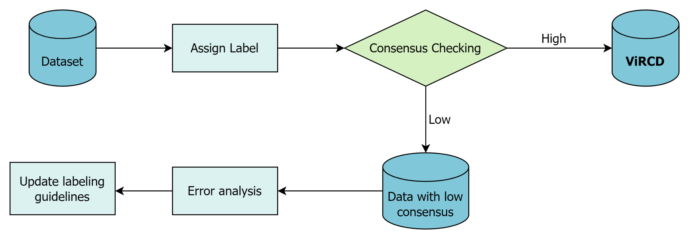
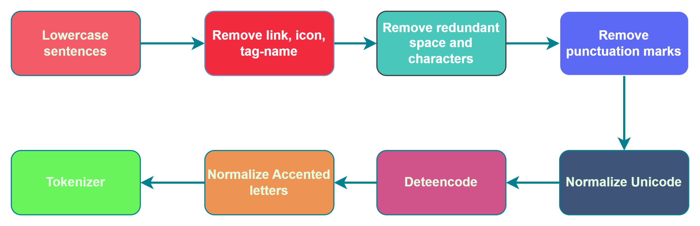
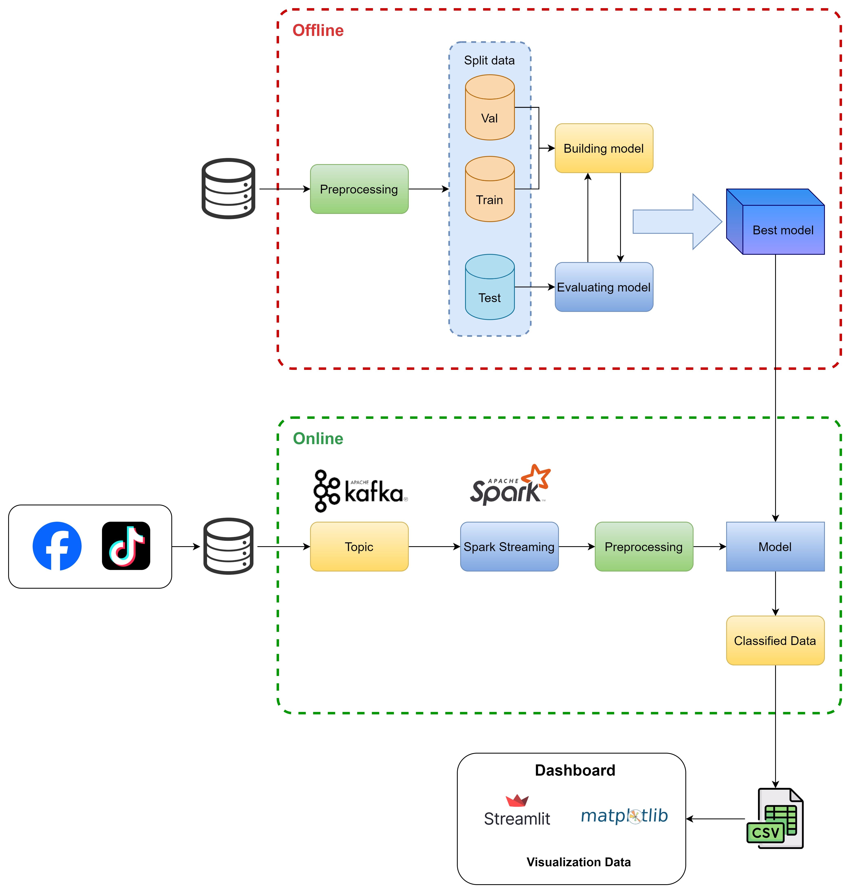

# A Big Data-empowered System for Real-time Detection of Regional Discriminatory Comments on Vietnamese Social Media

[](https://arxiv.org/pdf/2411.02587)
[](https://huggingface.co/datasets/anhuynh19/pbvm)

This repository contains the implementation and dataset for the paper **"A Big Data-empowered System for Real-time Detection of Regional Discriminatory Comments on Vietnamese Social Media"**.

## 📄 Abstract

Regional discrimination is a persistent social issue in Vietnam. While existing research has explored hate speech, the specific issue of regional discrimination remains under-addressed. This project proposes a **Big Data-empowered system** capable of real-time detection of regional discriminatory comments. We introduce the **ViRDC (Vietnamese Regional Discrimination Comments)** dataset and benchmark various Machine Learning and Deep Learning models, with **PhoBERT** achieving the highest performance.

## 🏗 System Architecture

The system is designed to handle real-time data streaming and processing using a Big Data pipeline:

1.  **Data Crawling:** Real-time comment collection from social media platforms (e.g., Facebook, TikTok).
2.  **Message Queue (Kafka):** Buffers data for streaming.
3.  **Stream Processing (Apache Spark):** Processes data in real-time batches.
4.  **Detection Engine:** Deployed AI models identify discriminatory content.
5.  **Storage & Visualization:** Results are stored in MongoDB and displayed via a web dashboard (ReactJS + Spring Boot).

## 📂 ViRDC Dataset

We introduce the **ViRDC** dataset, specifically curated for this task.

* **Total Samples:** 4,000 comments.
* **Labels:**
    * `0`: Other (Non-discriminatory)
    * `1`: Discrimination (Discrimination against Northern people)
    * `2`: Supportive (Discrimination against Middle region people)
* **Data Split:** 80% Training, 20% Testing.

## 🚀 Methods & Models

We experimented with both traditional Machine Learning and State-of-the-art Transformer models.

### Supported Models:
* **Traditional ML:** Logistic Regression, SVM, Naive Bayes, Random Forest
* **Transformers:** PhoBERT, Bert-base-multilingual-cased, XML-RoBERTa

### Performance Highlights:

| Model | Accuracy |  F1-Score |
|-------|----------|----------|
| **Random Forest** | **0.9712** | **0.9700** |
| Multinomial Logistic Regression | 0.9108  | 0.9100 | 
| Multinomial Naive Bayes   | 0.8400 | 0.8300 | 
| XML-RoBERTa | 0.8979 | 0.8902 | 
| PhoBert | 0.9206  | 0.9187 | 
| Bert-base-multilingual-cased |0.9174|  0.9154  | 

*Random Forest demonstrated the best performance due to its base on the frequency of words in dataset.*

## System Architecture

<div align="center">

<div>
     
    <p style="font-size: 0.9em; font-style: italic; color: #000000ff; margin-top: 5px;">
        Figure 1: Data Labeling Process
    </p>    
</div>
<div>
     
    <p style="font-size: 0.9em; font-style: italic; color: #000000ff; margin-top: 5px;">
        Figure 2: Preprocessing Steps
    </p>    
</div>

<div>
     
    <p style="font-size: 0.9em; font-style: italic; color: #000000ff; margin-top: 5px;">
        Figure 3: The architecture of the proposed system
    </p>    
</div>

</div>


## 🛠 Tech Stack

* **Language:** Python
* **Deep Learning Framework:** PyTorch, Hugging Face Transformers
* **Big Data:** Apache Spark, Apache Kafka
* **Backend/Frontend:** Spring Boot, ReactJS
* **Database:** MongoDB

## 🔧 Installation & Usage

### Prerequisites
* Python 3.8+
* Apache Spark & Kafka (for system deployment)
* PyTorch

### Steps
1.  Clone the repository:
    ```bash
    git clone https://github.com/yourusername/ViRDC-Detection.git 
    cd The-Discrimination-Detection-Project
    ```

## 📚 Citation

If you use this code or dataset in your research, please cite our paper:

```bibtex

@misc{huynh2024bigdataempoweredsystemrealtime,
      title={A Big Data-empowered System for Real-time Detection of Regional Discriminatory Comments on Vietnamese Social Media}, 
      author={An-Nghiep Huynh and Thanh-Dat Do and Trong-Hop Do},
      year={2024},
      eprint={2411.02587},
      archivePrefix={arXiv},
      primaryClass={cs.CL},
      url={[https://arxiv.org/abs/2411.02587](https://arxiv.org/abs/2411.02587)}, 
}